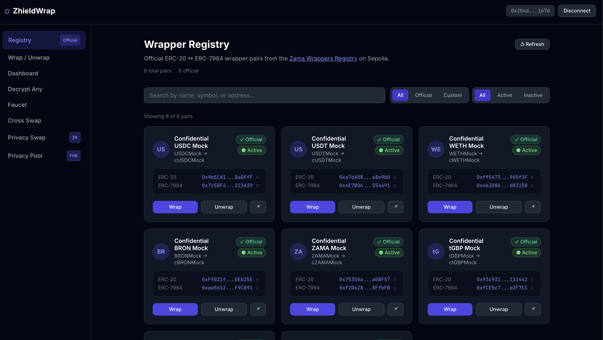

# ZhieldWrap — Confidential Wrapper Registry

> **Submission for:** Zama Hackathon Track — *Build the Confidential Wrapper Registry App*

A production-ready dApp that turns the [Zama Wrappers Registry](https://docs.zama.org/protocol/protocol-apps/addresses/testnet/sepolia#wrappers-registry) into a complete privacy infrastructure layer — wrap, swap, and decrypt confidential ERC-7984 tokens on-chain via [fhEVM](https://github.com/zama-ai/fhevm) by Zama. The innovation layer combines **FHE** (fully homomorphic encryption for confidential on-chain amounts) with **ZK proofs** (Groth16 for unlinkable two-wallet swaps) — using both together to cover what neither can do alone.

**Live URL:** https://zhieldwrap.vercel.app  
**Network:** Sepolia Testnet (chainId: 11155111)

---

## Demo Video

[](https://youtu.be/QkzJ3og9bFI)

---

## Track Requirements — All Met ✅

| Requirement | Status | Where |
|---|---|---|
| Web dApp with public live URL | ✅ | https://zhieldwrap.vercel.app |
| Sepolia support (wrap / unwrap / decrypt) | ✅ | All pages |
| Hybrid registry: onchain primary + local config secondary | ✅ | `packages/core/src/registry.ts` |
| All official cTokenMocks from Sepolia registry | ✅ | 8 pairs auto-loaded from onchain registry |
| Wrap (ERC-20 → ERC-7984) for every registry pair | ✅ | `/wrap` |
| Unwrap (ERC-7984 → ERC-20) for every registry pair | ✅ | `/wrap` |
| EIP-712 user-decryption for **any** ERC-7984 (paste-an-address) | ✅ | `/decrypt` |
| Faucet for official cTokenMock test tokens | ✅ | `/faucet` |
| Documented process for adding new pairs | ✅ | [Adding Custom Pairs](#adding-custom-pairs) below |
| Open source public GitHub repository | ✅ | This repo |

---

## Why This Matters

Today, developers spin up their own ERC-20 testnet tokens and ERC-7984 wrappers instead of using the ones already in the official Zama Wrappers Registry. That fragments the ecosystem: every team ships against a slightly different set of tokens, integrations don't compose, and users end up with a wallet full of look-alike confidential assets that don't actually interoperate.

ZhieldWrap solves this by making the **official registry the path of least resistance** — a polished app where the canonical ERC-20 ↔ ERC-7984 pairs are easy to find, easy to wrap/unwrap, easy to decrypt, and easy to extend with new pairs through a documented process. The innovation layer adds on-chain privacy primitives (FHE swaps, ZK mixing) to show what becomes possible once the registry is truly usable.

---

## Core Features (Track Requirements)

### 1. Registry Browser — `/registry`

Reads the [official onchain Zama Wrappers Registry](https://sepolia.etherscan.io/address/0x2f0750Bbb0A246059d80e94c454586a7F27a128e) as the **primary source of truth**. Every official ERC-20 ↔ ERC-7984 pair on Sepolia is shown with full token metadata: symbol, name, decimals, and both contract addresses. Official pairs are labeled **"✓ Official"**; custom local-config pairs are labeled **"⚠ Custom"**.

**Hybrid source logic** (`packages/core/src/registry.ts`):
```
fetchAllPairs()
  ├─ [Primary]  Call getAllPairs() on the onchain registry contract
  │               → RegistryPair[] marked isOfficial: true
  ├─ [Fallback] On RPC failure → use OFFICIAL_PAIRS hardcoded in constants.ts
  └─ [Secondary] Merge LOCAL_PAIRS from pairs.config.ts
                   - Drop any local pair whose erc20Address matches an official pair
                   - Mark remaining as isOfficial: false, isCustom: true
                   - Return [...officialPairs, ...customPairs]
```

---

### 2. Wrap / Unwrap — `/wrap`

Full wrap and unwrap flow for every registered pair with automatic approval handling, balance checks, and clear transaction status.

**Wrap (ERC-20 → ERC-7984):**
```
User selects pair + enters amount
  ├─1─► ERC20.approve(cTokenAddress, amount)   — ERC-20 approval
  └─2─► cToken.wrap(userAddress, amount)        — balance becomes euint64 on-chain ✓
```

**Unwrap (ERC-7984 → ERC-20):**
```
  └─1─► cToken.unwrap(userAddress, userAddress, encAmount)
            — burns encrypted cToken, returns plain ERC-20 ✓
```

Error handling covers: insufficient balance, missing approval, wrong network, and unsupported token.

---

### 3. Decrypt Any ERC-7984 Balance — `/decrypt`

Decrypts the connected wallet's encrypted balance for **any** ERC-7984 token — not just registry pairs. Users can pick from the registry dropdown **or paste any contract address** directly.

**EIP-712 user-decryption flow** (`@zama-fhe/react-sdk 2.5.0`):
```typescript
// React SDK — useUserDecrypt hook
const { data } = useUserDecrypt(
  { handles: [{ handle: encHandle, contractAddress: cTokenAddress }] },
  { enabled: !!encHandle && isConnected }
);
const balance = data?.[encHandle] as bigint;
// Hook internally: builds EIP-712 typed data → MetaMask sign → Zama KMS → plaintext bigint
```

---

### 4. Faucet — `/faucet`

Claims official cTokenMock test tokens directly on Sepolia. Each token's underlying ERC-20 exposes a public `mint()` function. The faucet enforces a client-side cooldown (localStorage) to prevent button spam.

```typescript
// packages/core/src/faucet.ts
const erc20 = new ethers.Contract(pair.erc20Address, ["function mint(address,uint256)"], signer);
await erc20.mint(userAddress, FAUCET_MINT_AMOUNT);
```

---

## Official Sepolia Pairs

Registry: [`0x2f0750Bbb0A246059d80e94c454586a7F27a128e`](https://sepolia.etherscan.io/address/0x2f0750Bbb0A246059d80e94c454586a7F27a128e) · Source: [Zama Docs](https://docs.zama.org/protocol/protocol-apps/addresses/testnet/sepolia#wrappers-registry)

| cToken | ERC-7984 Address | ERC-20 Underlying | Dec | Faucet |
|---|---|---|---|---|
| cUSDCMock | [`0x7c5BF43...`](https://sepolia.etherscan.io/address/0x7c5BF43B851c1dff1a4feE8dB225b87f2C223639) | [`0x9b5Cd13...`](https://sepolia.etherscan.io/address/0x9b5Cd13b8eFbB58Dc25A05CF411D8056058aDFfF) | 6 | ✅ |
| cUSDTMock | [`0x4E7B06D...`](https://sepolia.etherscan.io/address/0x4E7B06D78965594eB5EF5414c357ca21E1554491) | [`0xa7dA08F...`](https://sepolia.etherscan.io/address/0xa7dA08FafDC9097Cc0E7D4f113A61e31d7e8e9b0) | 6 | ✅ |
| cWETHMock | [`0x4620862...`](https://sepolia.etherscan.io/address/0x46208622DA27d91db4f0393733C8BA082ed83158) | [`0xff54739...`](https://sepolia.etherscan.io/address/0xff54739b16576FA5402F211D0b938469Ab9A5f3F) | 18 | ✅ |
| cBRONMock | [`0xaa5612F...`](https://sepolia.etherscan.io/address/0xaa5612FA27c927a0c7961f5AEFEE5ba3A0F9C891) | [`0xFf021fB...`](https://sepolia.etherscan.io/address/0xFf021fB13cA64e5354c62c954b949a88cfDEb25E) | 18 | ✅ |
| cZAMAMock | [`0xf2D628d...`](https://sepolia.etherscan.io/address/0xf2D628d2598aF4eAF94CB76a437Ff86CA78FfbFB) | [`0x75355a8...`](https://sepolia.etherscan.io/address/0x75355a85c6FB9df5f0C80FF54e8747EEe9a0BF57) | 18 | ✅ |
| ctGBPMock | [`0xfCE5c70...`](https://sepolia.etherscan.io/address/0xfCE5c7069c5525eF6c8C2b2E35A745bA20a2F7CC) | [`0x93c9312...`](https://sepolia.etherscan.io/address/0x93c931278A2aad1916783F952f94276eA5111442) | 18 | ✅ |
| cXAUtMock | [`0xe4FcF84...`](https://sepolia.etherscan.io/address/0xe4FcF848739845BC81Dee1d5352cf3844F0a60C7) | [`0x24377AE...`](https://sepolia.etherscan.io/address/0x24377AE4AA0C45ecEe71225007f17c5D423dd940) | 18 | ✅ |
| ctGBP | [`0x167DC96...`](https://sepolia.etherscan.io/address/0x167DC962808B32CFFFc7e14B5018c0bE06A3A208) | [`0xf6Ef9AD...`](https://sepolia.etherscan.io/address/0xf6Ef9ADB61A48E29E36bc873070A46A3D2667ff3) | 18 | ❌ |

---

## Adding Custom Pairs

Open `packages/core/src/pairs.config.ts` and add to `LOCAL_PAIRS`:

```typescript
export const LOCAL_PAIRS: RegistryPair[] = [
  {
    id: "custom-1",                              // must be unique
    erc20Address:     "0xYourERC20OnSepolia",    // standard ERC-20
    erc7984Address:   "0xYourERC7984OnSepolia",  // ERC-7984 wrapper for that ERC-20
    name:             "My Dev Token",
    symbol:           "cMYT",                    // convention: "c" prefix
    underlyingSymbol: "MYT",
    decimals:         18,                        // must match ERC-20 decimals exactly
    isActive:   true,
    isOfficial: false,   // always false for local config
    isCustom:   true,    // always true for local config
    hasFaucet:  false,   // true only if ERC-20 has a public mint()
    createdAt:  0,
  }
];
```

**Rules:**
- Both contracts must be on **Sepolia** (chainId 11155111)
- If a local pair shares `erc20Address` with an official registry pair, **the official pair wins**
- Custom pairs appear with a yellow **"⚠ Custom"** badge in the registry

After adding: `pnpm build && vercel deploy`

To get officially listed (green "✓ Official" badge): deploy an ERC-7984 wrapper following the Zama standard and request registration on the onchain registry. Once registered, it auto-appears on the next fetch.

---

## Innovation Layer — Beyond the Requirements

On top of the required registry features, ZhieldWrap ships a full **privacy infrastructure layer** using FhEVM + ZK proofs:

| Feature | Contract | Description |
|---|---|---|
| **Confidential Swap** | `ConfidentialSwapPool` | cToken ↔ cToken 1:1 FHE swap — swap amount **never leaves ciphertext** |
| **Cross-Pair Swap** | `CrossSwapRouter` | Pay with plain ERC-20, receive encrypted cToken in one transaction |
| **ZK Private Swap** | `PrivacyPool` + `ZKVerifier` | Two-wallet unlinkable swap: Wallet A deposits with ZK commitment, Wallet B withdraws with Groth16 proof |

> **FHE + ZK + Merkle Tree — all three in `PrivacyPool.sol`:**  
> The deposit stores the **amount as `euint64` (FHE-encrypted)** — the chain never sees a plaintext value.  
> The commitment `Poseidon(secret, amount)` is inserted as a leaf into a **depth-20 Merkle tree**.  
> To withdraw, Wallet B produces a **Groth16 ZK proof** that it knows a secret for a leaf in the tree — without revealing which leaf, which wallet deposited, or how much.  
> FHE hides *what*, ZK + Merkle tree hides *who*.

### Innovation Contracts (Sepolia)

| Contract | Address |
|---|---|
| `ConfidentialSwapPool.sol` | [`0x88D2dDC3...`](https://sepolia.etherscan.io/address/0x88D2dDC39Cde7cf0195f7713784D8e60f857Fe0a) |
| `CrossSwapRouter.sol` | [`0x65422Cde...`](https://sepolia.etherscan.io/address/0x65422Cde6Af545d84184a55f6b6963B75812dcc2) |
| `PrivacyPool.sol` | [`0x6Cb4dA4E...`](https://sepolia.etherscan.io/address/0x6Cb4dA4E8712866ED8B98c753DC396D94281C36E) |
| `ZKVerifier.sol` | [`0x62dBF272...`](https://sepolia.etherscan.io/address/0x62dBF2724FA845A00712FD992736289FA6a72F6d) |

### FHE Highlight — Amount Never Leaves Ciphertext

```solidity
// ConfidentialSwapPool.sol — single-transaction cToken↔cToken swap
function onConfidentialTransferReceived(
    address from, euint64 amount, bytes calldata data
) external override returns (bytes4) {
    address outputToken = abi.decode(data, (address));
    // Reuse the SAME encrypted handle — no plaintext amount at any step
    FHE.allowThis(amount);
    FHE.allowTransient(amount, outputToken);
    IERC7984Transfer(outputToken).confidentialTransfer(from, amount);
    return IERC7984Receiver.onConfidentialTransferReceived.selector;
}
```

### ZK Highlight — Unlinkable Two-Wallet Swap

```
Wallet A: deposits cUSDCMock with commitment = Poseidon(secret, amount)
         → Merkle tree grows, no link to amount or recipient

Wallet B: generates Groth16 proof off-chain
         → pool.withdraw(cUSDTMock, proof, root, nullifier)
         → receives cUSDTMock — fully unlinkable from Wallet A ✓
```

---

## Quick Start

```bash
# Clone + install
git clone https://github.com/destination071159-boop/zhieldWrap && cd zhieldWrap
pnpm install

# Web app
cd apps/web && pnpm dev          # → http://localhost:5173
```

---

## Tech Stack

| Layer | Libraries |
|---|---|
| Frontend | React 18, TypeScript, Vite 5, TailwindCSS |
| Wallet | wagmi v2, viem, MetaMask (injected) |
| FHE | `@fhevm/solidity ^0.11.1`, `@zama-fhe/react-sdk 2.5.0` |
| ZK | Circom 2.0, snarkjs Groth16, poseidon-lite, fixed-merkle-tree (depth-20) |
| Contracts | Solidity ^0.8.24, Hardhat, OpenZeppelin confidential-contracts |
| Monorepo | pnpm workspaces, Turborepo |

---

## Further Reading

- [fhEVM Documentation](https://docs.zama.ai/fhevm)
- [ERC-7984 Standard](https://eips.ethereum.org/EIPS/eip-7984)
- [Zama Testnet Addresses](https://docs.zama.org/protocol/protocol-apps/addresses/testnet/sepolia)
- [Zama Wrappers Registry](https://sepolia.etherscan.io/address/0x2f0750Bbb0A246059d80e94c454586a7F27a128e)

---

## License

MIT

---

**Built with ❤️ for the Zama FhEVM ecosystem**

The Zama Wrappers Registry already exists on-chain — but nothing makes it usable. Every developer deploys their own test tokens instead of using the official ones, fragmenting the ecosystem. And even if you use the registry, **there's no privacy layer on top**.

### 1. DeFi Transactions Leak Everything

Standard ERC-20 swaps are fully public. Everyone watching the mempool sees your token, your amount, and your wallet. With FhEVM:
- Swap amounts are `euint64` ciphertexts — bots see an encrypted handle, not a dollar value
- The `ConfidentialSwapPool` performs the entire cToken↔cToken swap without a single plaintext amount ever touching the EVM

### 2. Swap Routes Expose Strategy

When you swap USDC for cUSDT via the `CrossSwapRouter`, your ERC-20 input is visible — but the routing logic wraps it into an encrypted cToken on the fly. Your output balance is encrypted from the moment it leaves the router.

### 3. On-Chain Transfers Link Wallets

Even with encrypted balances, depositing and withdrawing from the same pool links your wallets. The `PrivacyPool` breaks this using ZK proofs:
- Wallet A deposits with a Poseidon commitment (no on-chain link to amount or recipient)
- Wallet B withdraws using a Groth16 ZK proof — completely unlinkable from the deposit
- The Merkle tree is rebuilt from ALL deposits (cross-token) so the anonymity set is maximized

### 4. No Way to Check Your Encrypted Balance Without a Full Node

`euint64` balances are stored as ciphertexts. Users can't read them without going through the Zama KMS EIP-712 decryption flow. The app handles this end-to-end — paste any ERC-7984 address and decrypt your balance in one click.

---

## Token Standard — ERC-7984

All confidential operations use **ERC-7984** tokens (e.g. `cUSDCMock`, `cUSDTMock`). ERC-7984 is Zama's encrypted-balance token standard:

- **Balances are `euint64` ciphertexts** — the chain never sees a plaintext amount
- **`confidentialTransfer`** — transfers an encrypted handle between addresses
- **`confidentialTransferAndCall`** — transfers AND calls `onConfidentialTransferReceived` on the recipient contract (used by `ConfidentialSwapPool` and `PrivacyPool`)
- **`wrap(address to, uint256 amount)`** — deposits ERC-20, mints cToken
- **`unwrap(address from, address to, euint64 amount)`** — burns cToken, returns ERC-20

---

## Contracts (Sepolia)

### ZhieldWrap Custom Contracts

| Contract | Description | Address |
|---|---|---|
| `ConfidentialSwapPool.sol` | Direct FHE cToken↔cToken 1:1 swap pool. Accepts `confidentialTransferAndCall`, reuses the encrypted handle to send output cToken in the same callback — amount never leaves ciphertext. | [`0x88D2dDC39Cde7cf0195f7713784D8e60f857Fe0a`](https://sepolia.etherscan.io/address/0x88D2dDC39Cde7cf0195f7713784D8e60f857Fe0a) |
| `CrossSwapRouter.sol` | ERC-20 → cToken routing. User pays with plain ERC-20, receives a confidential ERC-7984 token. Registered pairs seeded with liquidity. | [`0x65422Cde6Af545d84184a55f6b6963B75812dcc2`](https://sepolia.etherscan.io/address/0x65422Cde6Af545d84184a55f6b6963B75812dcc2) |
| `PrivacyPool.sol` | ZK mixing pool. Deposits via ERC-7984 receiver + Poseidon commitment. Withdrawals via Groth16 ZK proof — fully unlinkable from deposits. Depth-20 Merkle tree. | [`0x6Cb4dA4E8712866ED8B98c753DC396D94281C36E`](https://sepolia.etherscan.io/address/0x6Cb4dA4E8712866ED8B98c753DC396D94281C36E) |
| `ZKVerifier.sol` | Groth16 verifier generated from `privacyProof.circom` via snarkjs. Verifies `[root, nullifier]` public signals on-chain. | [`0x62dBF2724FA845A00712FD992736289FA6a72F6d`](https://sepolia.etherscan.io/address/0x62dBF2724FA845A00712FD992736289FA6a72F6d) |

### Official Zama Registry Pairs (Sepolia)

Registry contract: [`0x2f0750Bbb0A246059d80e94c454586a7F27a128e`](https://sepolia.etherscan.io/address/0x2f0750Bbb0A246059d80e94c454586a7F27a128e)

| cToken | ERC-7984 Address | ERC-20 Underlying | Faucet |
|---|---|---|---|
| cUSDCMock | [`0x7c5BF43...`](https://sepolia.etherscan.io/address/0x7c5BF43B851c1dff1a4feE8dB225b87f2C223639) | [`0x9b5Cd13...`](https://sepolia.etherscan.io/address/0x9b5Cd13b8eFbB58Dc25A05CF411D8056058aDFfF) | ✅ |
| cUSDTMock | [`0x4E7B06D...`](https://sepolia.etherscan.io/address/0x4E7B06D78965594eB5EF5414c357ca21E1554491) | [`0xa7dA08F...`](https://sepolia.etherscan.io/address/0xa7dA08FafDC9097Cc0E7D4f113A61e31d7e8e9b0) | ✅ |
| cWETHMock | [`0x4620862...`](https://sepolia.etherscan.io/address/0x46208622DA27d91db4f0393733C8BA082ed83158) | [`0xff54739...`](https://sepolia.etherscan.io/address/0xff54739b16576FA5402F211D0b938469Ab9A5f3F) | ✅ |
| cBRONMock | [`0xaa5612F...`](https://sepolia.etherscan.io/address/0xaa5612FA27c927a0c7961f5AEFEE5ba3A0F9C891) | [`0xFf021fB...`](https://sepolia.etherscan.io/address/0xFf021fB13cA64e5354c62c954b949a88cfDEb25E) | ✅ |
| cZAMAMock | [`0xf2D628d...`](https://sepolia.etherscan.io/address/0xf2D628d2598aF4eAF94CB76a437Ff86CA78FfbFB) | [`0x75355a8...`](https://sepolia.etherscan.io/address/0x75355a85c6FB9df5f0C80FF54e8747EEe9a0BF57) | ✅ |

---

## Features

| Feature | Description |
|---|---|
| **Registry Browser** | Browse all official ERC-7984 pairs from the Zama onchain registry + custom local pairs |
| **Wrap / Unwrap** | ERC-20 → ERC-7984 with automatic approval flow; ERC-7984 → ERC-20 |
| **Balance Dashboard** | View ERC-20 and encrypted ERC-7984 balances across all pairs |
| **Decrypt Any** | Decrypt the balance of ANY ERC-7984 token by address via EIP-712 + Zama KMS |
| **Faucet** | Claim official cTokenMock test tokens on Sepolia |
| **Confidential Swap** | cToken → cToken 1:1 swap via `ConfidentialSwapPool` — amount stays encrypted throughout |
| **Cross-Pair Swap** | ERC-20 → cToken via `CrossSwapRouter` — pay with plain tokens, receive confidential |
| **ZK Private Swap** | Two-wallet unlinkable swap: Wallet A deposits, Wallet B withdraws via Groth16 ZK proof |

---

## FHE Highlights

### Confidential Swap: Amount Never Leaves Ciphertext

```solidity
// ConfidentialSwapPool.sol — onConfidentialTransferReceived callback
function onConfidentialTransferReceived(
    address from,
    euint64 amount,
    bytes calldata data
) external override returns (bytes4) {
    address outputToken = abi.decode(data, (address));
    require(supportedToken[msg.sender], "input not supported");
    require(supportedToken[outputToken],  "output not supported");
    require(msg.sender != outputToken,    "same token");

    // Reuse the SAME encrypted handle for output — amount never revealed
    FHE.allowThis(amount);
    FHE.allowTransient(amount, outputToken);
    IERC7984Transfer(outputToken).confidentialTransfer(from, amount);

    emit SwapExecuted(from, msg.sender, outputToken);
    return IERC7984Receiver.onConfidentialTransferReceived.selector;
}
```

The encrypted `amount` handle from the deposit is reused directly for the output transfer. The FhEVM ACL (`FHE.allowTransient`) grants the output token contract transient access — the swap amount is never decrypted at any point.

---

### ZK Private Swap: Deposit → Commitment

```solidity
// PrivacyPool.sol — onConfidentialTransferReceived
function onConfidentialTransferReceived(
    address /* from */,
    euint64 amount,
    bytes calldata data
) external override returns (bytes4) {
    bytes32 commitment = abi.decode(data, (bytes32));
    require(!_deposited[commitment], "commitment already used");

    // Store encrypted amount under the commitment
    _deposits[commitment] = amount;
    _deposited[commitment] = true;

    // Insert leaf into the Merkle tree — anonymity set grows with every deposit
    _insertLeaf(commitment);
    anonymitySet[msg.sender]++;

    emit Deposit(msg.sender, commitment, uint32(_nextIndex - 1));
    return IERC7984Receiver.onConfidentialTransferReceived.selector;
}
```

The commitment `Poseidon(secret, amount)` is stored — never the amount or the sender's wallet. Any wallet that knows `secret` can prove membership and withdraw.

---

### ZK Private Swap: Withdraw → Unlinkable

```solidity
// PrivacyPool.sol — withdraw
function withdraw(
    address outputToken,
    uint256[2] calldata pA,
    uint256[2][2] calldata pB,
    uint256[2] calldata pC,
    bytes32 root,
    bytes32 nullifier
) external {
    require(isKnownRoot(root), "unknown root");
    require(!nullifierSpent[nullifier], "already withdrawn");

    // Verify ZK proof: prover knows secret s.t. commitment is in the tree
    // Public signals: [root, nullifier]
    require(
        verifier.verifyProof(pA, pB, pC, [uint256(root), uint256(nullifier)]),
        "invalid proof"
    );

    nullifierSpent[nullifier] = true;
    // Send confidential tokens to caller — amount stays encrypted
    IERC7984Pool(outputToken).confidentialTransfer(msg.sender, _deposits[commitment]);
}
```

The Groth16 proof (`privacyProof.circom`) proves: *"I know a secret such that `Poseidon(secret, amount)` is a leaf in the Merkle tree at root `root`, and `Poseidon(secret, 1)` equals this nullifier."* On-chain, only the root and nullifier are public. Depositor wallet, amount, and recipient wallet are all hidden.

---

## Architecture

```
zhieldwrap/
├── frontend/
│   └── src/
│       ├── pages/
│       │   ├── Registry.tsx         # Browse all ERC-7984 pairs
│       │   ├── Wrap.tsx             # Wrap / Unwrap flow
│       │   ├── Dashboard.tsx        # Encrypted balance viewer
│       │   ├── DecryptAny.tsx       # Decrypt any ERC-7984 by address
│       │   ├── Faucet.tsx           # Claim cTokenMock test tokens
│       │   ├── CrossSwap.tsx        # ERC-20 → cToken via CrossSwapRouter
│       │   ├── PrivateSwap.tsx      # Two-wallet ZK swap (deposit + withdraw)
│       │   └── Pool.tsx             # FHE confidential swap pool
│       ├── hooks/
│       │   ├── useWrap.ts           # Approval → wrap/unwrap
│       │   ├── useConfidentialSwap.ts
│       │   ├── useCrossSwap.ts
│       │   ├── useDecryptAny.ts
│       │   ├── useFaucet.ts
│       │   ├── usePrivacyPool.ts
│       │   ├── useRegistry.ts
│       │   └── useZKProof.ts
│       └── core/                    # Contract interactions + constants
│           ├── constants.ts         # Deployed addresses + OFFICIAL_PAIRS
│           ├── pairs.config.ts      # Local custom pairs
│           ├── registry.ts          # Hybrid fetch (on-chain + local)
│           ├── router.ts            # CrossSwapRouter interactions
│           ├── privacy.ts           # PrivacyPool ZK interactions
│           ├── zkProof.ts           # Groth16 proof generation (snarkjs)
│           ├── fhe.ts               # FHE helpers
│           ├── wrap.ts              # Wrap/unwrap contract calls
│           ├── faucet.ts            # Faucet mint calls
│           ├── types.ts
│           └── errors.ts
│
├── contracts/
│   ├── contracts/
│   │   ├── ConfidentialSwapPool.sol # FHE cToken↔cToken swap
│   │   ├── CrossSwapRouter.sol      # ERC-20 → cToken routing
│   │   ├── PrivacyPool.sol          # ZK mixing pool (FHE + ZK + Merkle)
│   │   ├── ZKVerifier.sol           # Groth16 verifier (snarkjs output)
│   │   └── MerkleTree.sol           # Poseidon depth-20 Merkle tree
│   └── scripts/                     # Deploy + seed scripts
│
└── circuits/
    └── privacyProof.circom          # ZK circuit: Poseidon commitment + nullifier
```

---

## System Overview

```
┌──────────────────────────────────────────────────────────────────────┐
│                         Frontend (Vite + React)                      │
│   useEncrypt() · useUserDecrypt() · @zama-fhe/react-sdk              │
│   wagmi v2 · MetaMask                                                │
└───────────────────────────┬──────────────────────────────────────────┘
                            │ encrypted handles + ZK proofs
                            ▼
┌──────────────────────────────────────────────────────────────────────┐
│                      Sepolia Testnet (fhEVM)                         │
│                                                                      │
│  ┌──────────────────┐  ┌──────────────────┐  ┌──────────────────┐    │
│  │ConfidentialSwap  │  │ CrossSwapRouter  │  │   PrivacyPool    │    │
│  │Pool              │  │                  │  │  + ZKVerifier    │    │
│  │(FHE cToken swap) │  │(ERC-20 → cToken) │  │ (ZK mixing pool) │    │
│  └──────────────────┘  └──────────────────┘  └──────────────────┘    │
│                                                                      │
│  ┌────────────────────────────────────────────────────────────────┐  │
│  │           Official Zama ERC-7984 Token Contracts               │  │
│  │  cUSDCMock · cUSDTMock · cWETHMock · cBRONMock · cZAMAMock     │  │
│  └────────────────────────────────────────────────────────────────┘  │
│                                                                      │
│   ┌──────────────────────────────────────────────────────────────┐   │
│   │              Zama KMS (off-chain oracle network)             │   │
│   │         EIP-712 user-decrypt · publicDecrypt callbacks       │   │
│   └──────────────────────────────────────────────────────────────┘   │
└──────────────────────────────────────────────────────────────────────┘
```

---

## Flow 1 — Wrap ERC-20 → cToken

```
User
 │
 ├─1─► ERC20.approve(cToken, amount)
 │         standard ERC-20 approval
 │
 └─2─► cToken.wrap(userAddress, amount)
           ERC-20 transferred to wrapper → minted as euint64 ciphertext
           user's on-chain balance is now encrypted ✓
```

---

## Flow 2 — Confidential Swap (cToken ↔ cToken)

```
User
 │
 └─1─► cInput.confidentialTransferAndCall(
            pool,             // ConfidentialSwapPool address
            encHandle,        // useEncrypt({ value: amount, type: 'euint64' })
            inputProof,       // ZK input proof from Zama SDK
            abi.encode(cOutputAddress)
        )
        │
        └─► pool.onConfidentialTransferReceived(from, encAmount, data)
                │
                ├─► FHE.allowThis(encAmount)           // pool can operate on it
                ├─► FHE.allowTransient(encAmount, cOutput) // transient ACL grant
                └─► cOutput.confidentialTransfer(from, encAmount)
                        user receives cOutput — amount never decrypted ✓
```

---

## Flow 3 — Cross-Pair Swap (ERC-20 → cToken)

```
User
 │
 ├─1─► USDCMock.approve(CrossSwapRouter, amount)
 │
 └─2─► CrossSwapRouter.swap(
            inputERC20:    USDCMock,
            inputERC7984:  cUSDCMock,
            outputERC7984: cUSDTMock,
            outputERC20:   USDTMock,
            amount:        1_000_000   // 1 USDC (6 dec)
        )
        │
        ├─► Pull USDCMock from user
        ├─► Wrap USDCMock → cUSDCMock (router holds it)
        ├─► Check router has USDTMock reserves
        └─► Wrap USDTMock → cUSDTMock → send to user
                user receives cUSDTMock — encrypted balance ✓
```

---

## Flow 4 — ZK Private Swap (Two-Wallet Unlinkable)

```
Wallet A (depositor)
 │
 ├─1─► Generate commitment off-chain:
 │         secret = random bigint
 │         commitment = Poseidon(secret, amount)   // never revealed
 │
 ├─2─► useEncrypt({ value: amount, type: 'euint64' })
 │         → { encHandle, inputProof }
 │
 ├─3─► cUSDCMock.confidentialTransferAndCall(
 │         pool, encHandle, inputProof,
 │         abi.encode(commitment)
 │     )
 │     Pool inserts commitment into Merkle tree → emits Deposit event
 │
 └─4─► Wallet A shares SwapNote (base64 JSON) with Wallet B out of band
           { secret, amount, symbol }

─ ─ ─ ─ ─ ─ ─ (no on-chain link between A and B) ─ ─ ─ ─ ─ ─ ─

Wallet B (withdrawer) — different wallet, different IP
 │
 ├─5─► Decode SwapNote → recompute commitment + nullifier
 │         nullifier = Poseidon(secret, 1)
 │
 ├─6─► Fetch ALL Deposit events → rebuild Merkle tree locally
 │         (cross-token — full anonymity set)
 │
 ├─7─► Generate Groth16 ZK proof off-chain (snarkjs):
 │         Private inputs: secret, pathElements[], pathIndices[]
 │         Public signals:  [root, nullifier]
 │
 └─8─► PrivacyPool.withdraw(
            outputToken: cUSDTMock,  // can withdraw a DIFFERENT cToken
            pA, pB, pC,
            root, nullifier
        )
        Pool verifies proof → sends cUSDTMock to Wallet B ✓
        Wallet B is unlinkable from Wallet A ✓
```

---

## EIP-712 Balance Decryption

All balance decryptions use the Zama KMS via EIP-712 typed data signing. The app uses `@zama-fhe/react-sdk`:

```typescript
// Frontend — useUserDecrypt hook
const { data } = useUserDecrypt(
  { handles: [{ handle: encHandle, contractAddress: cTokenAddress }] },
  { enabled: !!encHandle }
);
const balance = data?.[encHandle] as bigint;
```

---

## Quick Start

### Prerequisites
- Node.js 20+
- pnpm 8+
- MetaMask on Sepolia

### Install & Run Web App

```bash
# 1. Clone
git clone https://github.com/destination071159-boop/zhieldWrap
cd zhieldWrap

# 2. Install
cd frontend && npm install

# 3. Start dev server
npm run dev
# → http://localhost:5173
```

### Deploy Contracts (Hardhat)

```bash
cd contracts
pnpm install

# Set env vars
cp .env.example .env
# Edit: PRIVATE_KEY, SEPOLIA_RPC_URL, ETHERSCAN_API_KEY

# Deploy
npx hardhat run scripts/deploy.ts --network sepolia

# Seed CrossSwapRouter liquidity
npx hardhat run scripts/seedLiquidity.ts --network sepolia
```

### Environment Variables (`frontend/.env`)

```env
# Optional — defaults to public Sepolia RPC
VITE_SEPOLIA_RPC=https://sepolia.drpc.org

# Optional — override deployed contract addresses
VITE_CROSS_SWAP_ROUTER_ADDRESS=0x65422Cde6Af545d84184a55f6b6963B75812dcc2
VITE_PRIVACY_POOL_ADDRESS=0x6Cb4dA4E8712866ED8B98c753DC396D94281C36E
VITE_CONFIDENTIAL_SWAP_POOL_ADDRESS=0x88D2dDC39Cde7cf0195f7713784D8e60f857Fe0a
```

---

## Tech Stack

```
Frontend
├── React 18 + TypeScript (strict)
├── Vite 5
├── TailwindCSS
├── ethers.js v6
├── wagmi v2 + viem
└── @zama-fhe/react-sdk 2.5.0

ZK Layer
├── Circom 2.0 (privacyProof.circom)
├── snarkjs (Groth16 prover)
├── poseidon-lite (hash function)
└── fixed-merkle-tree v0.7.3 (depth-20)

FHE Layer
├── @fhevm/solidity ^0.11.1
├── @fhevm/hardhat-plugin ^0.4.2
└── @openzeppelin/confidential-contracts ^0.4.0

Smart Contracts
├── Solidity ^0.8.24
└── Hardhat
```

---

## Adding Custom Pairs

Open `packages/core/src/pairs.config.ts` and add to `LOCAL_PAIRS`:

```typescript
export const LOCAL_PAIRS: RegistryPair[] = [
  {
    id: "custom-1",
    erc20Address:     "0xYourERC20OnSepolia",
    erc7984Address:   "0xYourERC7984OnSepolia",
    name:             "My Token",
    symbol:           "cMYT",
    underlyingSymbol: "MYT",
    decimals:         18,
    isActive:   true,
    isOfficial: false,
    isCustom:   true,
    hasFaucet:  false,
    createdAt:  0,
  }
];
```

Custom pairs appear with a **"⚠ Custom"** badge. Official registry pairs always win on address conflicts.

---

## Further Reading

- [fhEVM Documentation](https://docs.zama.ai/fhevm)
- [ERC-7984 Standard](https://eips.ethereum.org/EIPS/eip-7984)
- [Zama Testnet Addresses](https://docs.zama.org/protocol/protocol-apps/addresses/testnet/sepolia)
- [Zama Wrappers Registry](https://sepolia.etherscan.io/address/0x2f0750Bbb0A246059d80e94c454586a7F27a128e)

---

## License

MIT

---

**Built with ❤️ for the Zama FhEVM ecosystem**


**Live URL:** https://zhieldwrap.vercel.app  
**GitHub:** https://github.com/destination071159-boop/zhieldWrap  
**Network:** Sepolia Testnet (chainId: 11155111)

---
@@ -895,8 +106,8 @@ Source: [Zama Docs — Testnet Addresses](https://docs.zama.org/protocol/protoco

```bash
# 1. Clone the repo
git clone https://github.com/destination071159-boop/zhieldWrap
cd zhieldWrap

# 2. Install all dependencies (workspace-wide)
pnpm install
@@ -987,12 +198,56 @@ fetchAllPairs()
The app uses `@zama-fhe/react-sdk`'s `useUserDecrypt` hook to decrypt ERC-7984 balances:

```
---

## License

MIT

---

**Built with ❤️ for the Zama FhEVM ecosystem**